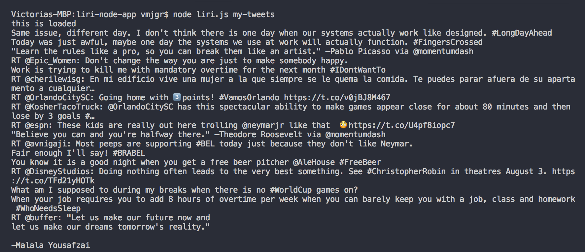
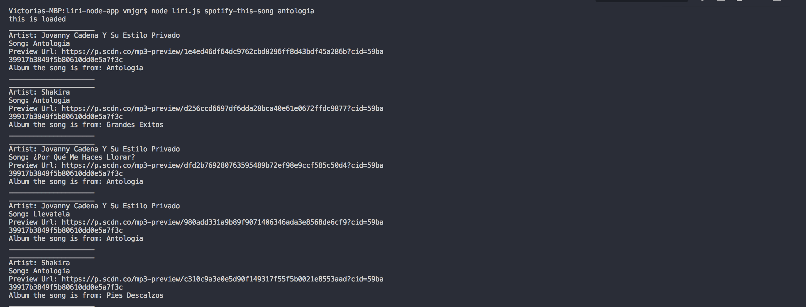
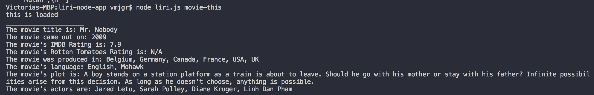
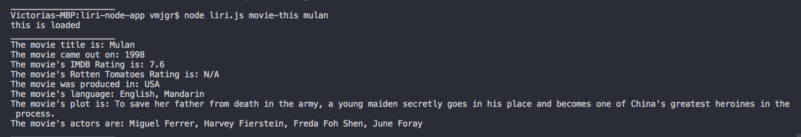

# liri-node-app

Liri is a command line based app similar to siri.

## Running the app

- Clone this repository to your machine
- In your terminal or command line change directory to liri-node-app folder
- Run the following code in the terminal/command line:
    ```
    npm install
    ```

## How to use?

To run this app, type the following commands into your terminal or command line and hit enter:
```
node liri.js my-tweets
```
This command will display tweets from the selected account.

```
node liri.js spotify-this-song insertSongName
```
This command will display information details from the selected song.

```
node liri.js movie-this insertMovieName
```
This command will display information details from the selected movie.

```
node liri.js do-what-it-says
```
This command will display a predetermined list of commands from random.txt

## Preview

Here are some screenshots of the app in action:

my-tweets command


spotify-this-song command


movie-this command



do-what-it-says command

